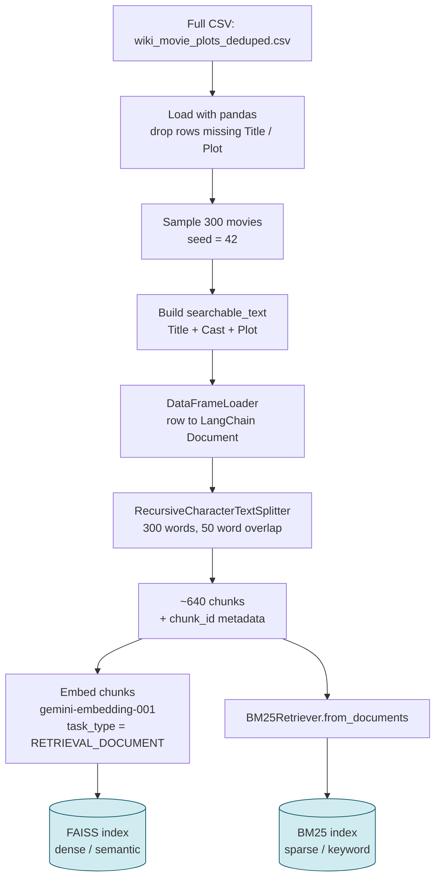
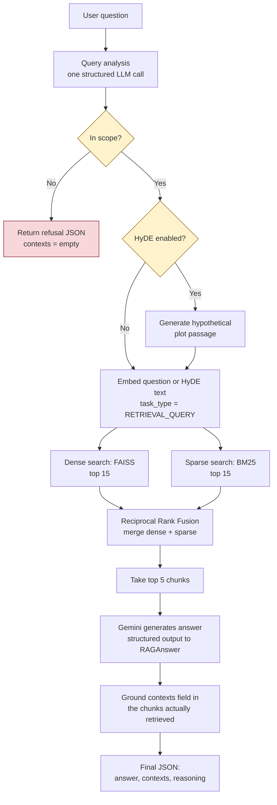

# Mini RAG System — Movie Plots 🎬

A lightweight, production-grade Retrieval-Augmented Generation (RAG) system built with **LangChain**, **FAISS**, **BM25**, and **Google Gemini** that answers questions over movie plot summaries and returns validated, grounded JSON outputs.

---

## 🌟 System Architecture

### 1. Ingestion & Indexing Pipeline (Horizontal Flow)



---

### 2. RAG Query & Generation Pipeline (Horizontal Flow)



---

## 🚀 Key Features

* **Hybrid Retrieval (Dense + Sparse)**: Combines **FAISS** (dense vector similarity for semantic understanding) and **BM25** (sparse keyword search for exact actor names, titles, and proper nouns).
* **Reciprocal Rank Fusion (RRF)**: Merges ranked results from dense and sparse search without score scale mismatches.
* **HyDE (Hypothetical Document Embeddings)**: Generates a hypothetical plot passage for dense embedding search to bridge the phrasing gap between questions and plot summaries.
* **Query Routing & Metadata Filtering**: Analyzes query scope and extracts filters for `Genre` and `Release Year` before retrieval. Out-of-corpus queries short-circuit early.
* **Word-Level Chunking**: Splits plot summaries into 300-word chunks (50-word overlap) along natural sentence/paragraph boundaries.
* **Actor & Title Indexing**: Enriches text payloads with `Title` and `Cast` metadata so queries targeting specific actors (e.g. *"Michael Rennie"*, *"Denzel Washington"*) hit exact keyword matches.
* **Strict Grounded Output**: Uses Pydantic models (`RAGAnswer`) to enforce validated JSON schema (`answer`, `contexts`, `reasoning`) grounded strictly in retrieved context.

---

## 📋 Structured JSON Output Schema

The system outputs a verified JSON payload conforming to the following structure:

```json
{
  "answer": "The movie 'The Day the Earth Stood Still' (1951) features an artificial intelligence robot named Gort and Klaatu who land in Washington, D.C.",
  "contexts": [
    "Title: The Day the Earth Stood Still\nCast: Michael Rennie, Patricia Neal\nPlot: When a flying saucer lands in Washington, D.C., the Army quickly surrounds it. A humanoid (Michael Rennie) emerges..."
  ],
  "reasoning": "The retrieved context explicitly confirms the 1951 film featuring Klaatu and Gort landing in Washington D.C."
}
```

---

## 🛠️ Project Structure

```text
Team D/
├── data/
│   └── wiki_movie_plots_deduped.csv   # Kaggle Movie Plots dataset
├── rag_movie_plots_langchain.ipynb     # Main RAG notebook implementation
├── README.md                           # Project documentation
├── requirements.txt                    # Python dependencies
└── .env                                # Environment config
```

---

## 📦 Getting Started

### Prerequisites

* Python **3.10+**
* Google Gemini API Key or GCP Vertex AI configuration.

### 1. Installation

Clone the repository and install the dependencies:

```bash
git clone <your-repo-url>
cd Team D
pip install -r requirements.txt
```

### 2. Environment Setup

Set up your Gemini / Google Cloud environment variables in a `.env` file or terminal session:

```bash
# Option A: Google Gemini API Key
export GEMINI_API_KEY="your-api-key-here"

# Option B: Google Cloud Vertex AI
export GOOGLE_CLOUD_PROJECT="your-gcp-project-id"
export GOOGLE_CLOUD_LOCATION="us-central1"
```

### 3. Running the Pipeline

Open and run `rag_movie_plots_langchain.ipynb` using Jupyter Notebook or VS Code:

```bash
jupyter notebook rag_movie_plots_langchain.ipynb
```

Execute cells sequentially to:
1. Load dataset & preprocess 300 movie plot samples.
2. Build FAISS and BM25 search indexes.
3. Test demo queries across semantic, hybrid actor matching, self-query filtering, and out-of-scope cases.

---

## 🎯 Architecture Summary

| Component | Choice / Metric |
| :--- | :--- |
| **LLM** | `gemini-2.5-flash` |
| **Embeddings** | `gemini-embedding-001` (Asymmetric Document/Query tasks) |
| **Vector Store** | In-memory `FAISS` |
| **Keyword Index** | `BM25Retriever` (Rank-BM25) |
| **Fusion Metric** | Reciprocal Rank Fusion ($k=60$) |
| **Chunking** | `RecursiveCharacterTextSplitter` ($300\text{ words}$, $50\text{ overlap}$) |
| **Output Format** | Pydantic validated JSON (`RAGAnswer`) |
